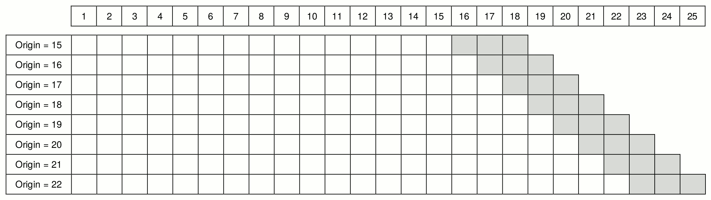
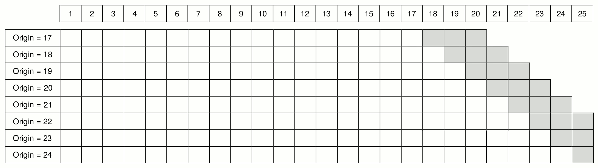
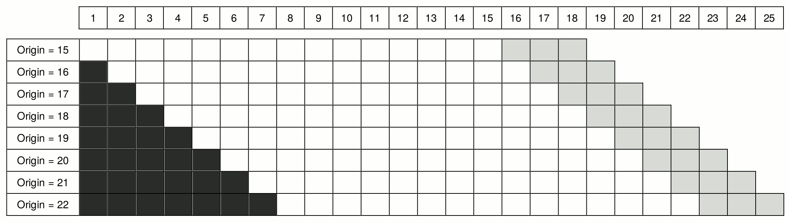

```{r setup, include = FALSE}
knitr::opts_chunk$set(
  collapse = TRUE,
  comment = "#>",
  fig.align="center",
  fig.height=4,
  fig.width=6
)

library(greybox)
```

When there is a need to select the most appropriate forecasting model or method for the data, the forecasters usually split the available sample into two parts: in-sample (aka "training set") and holdout sample (or out-sample, or "test set"). The model is then estimated on in-sample and its forecasting performance is evaluated [using some error measure](https://forecasting.svetunkov.ru/en/2017/07/29/naughty-apes-and-the-quest-for-the-holy-grail/) on the holdout sample.

If such a procedure done only once, then this is called "fixed origin" evaluation. However, the time series might contain outliers or level shifts and a poor model might perform better than the more appropriate one only because of that. In order to robustify the evaluation of models, something called "rolling origin" is used.

Rolling origin is an evaluation technique according to which the forecasting origin is updated successively and the forecasts are produced from each origin [@Tashman2000]. This technique allows obtaining several forecast errors for time series, which gives a better understanding of how the models perform. There are different options of how this can be done.

## How can this be done?

The figure below (from [@Svetunkov2017]) depicts the basic idea of rolling origin. White cells correspond to the in-sample data, while the light grey cells correspond to the three-steps-ahead forecasts. Time series has 25 observations in that figure, and the forecasts are produced from 8 origins, starting from the origin 15. The model is re-estimated on each iteration, and the forecasts are produced. After that a new observation is added at the end of the series and the procedure continues. The process stops when there is no more data to add. This could be considered as a rolling origin with a **constant holdout** sample size. As a result of this procedure 8 one to three steps ahead forecasts are produced. Based on them we can calculate the preferred error measures and choose the best performing model.

```{r out.width="75%", echo=FALSE}
# All defaults

```

Another option of producing forecasts from 8 origins would be to start from the origin 17 instead of 15 (see Figure below). In this case the procedure continues until origin 22, when the last three-steps-ahead forecast is produced, and then continues with the decreasing forecasting horizon. So the two-steps-ahead forecast is produced from the origin 23 and only one-step-ahead forecast is produced from the origin 24. As a result we obtain 8 one-step-ahead forecasts, 7 two-steps-ahead forecasts and 6 three-steps-ahead forecasts. This can be considered as a rolling origin with a **non-constant holdout** sample size. This can be useful in cases of small samples, when we don't have any observations to spare.

```{r out.width="75%", echo=FALSE}
# All defaults

```

Finally, in both of the cases above we had the **increasing in-sample** size. However for some research purposes we might need a **constant in-sample**. The figure below demonstrates such a situation. In this case on each iteration we add an observation at the end of the series and remove one from the beginning of the series (dark grey cells).

```{r out.width="75%", echo=FALSE}
# All defaults

```

## What does this have to do with R?

The function `ro()` from `greybox` package (written by Yves Sagaert and Ivan Svetunkov in 2016 on the way to the International Symposium on Forecasting) implements the rolling origin evaluation for any function you like with a predefined `call` and returns the desired `value`. It heavily relies on the two variables: `call` and `value` - so it is quite important to understand how to formulate them in order to get the desired results. Overall, `ro()` is a very flexible function, but, as a result, it is not very simple. Let's see how it works.

We start with a simple example, generating series from normal distribution:
```{r}
x <- rnorm(100,100,10)
```

We use ARIMA(0,1,1) for this example:
```{r}
ourCall <- "predict(arima(x=data,order=c(0,1,1)),n.ahead=h)"
```

The call that we specify includes two important elements: `data` and `h`. `data` specifies where the in-sample values are located in the function that we want to use, and it needs to be called "data" in the call. `h` will tell our function, where the forecasting horizon is specified in the selected function. Note that in this example we use `arima(x=data,order=c(0,1,1))`, which produces a desired ARIMA(0,1,1) model and then we use `predict(...,n.ahead=h)`, which produces a forecast from that model. The part `arima(x=data,order=c(0,1,1))` can also be simplified to `arima(data,order=c(0,1,1))` according to the general rules of R.

Having the call, we need also to specify what the function should return. This can be the conditional mean (point forecasts), prediction intervals, the parameters of a model, or, in fact, anything that the model returns (e.g. name of the fitted model and its likelihood). However, there are some differences in what the `ro()` returns depending on what the function you use returns. If it is a vector, then `ro()` will produce a matrix (with values for each origin in columns). If it is a matrix, then an array is returned. Finally, if it is a list, then a list of lists is returned.

In order not to overcomplicate things, let's start with collecting the conditional mean from the `predict()` function:
```{r}
ourValue <- "pred"
```

**NOTE**: If you do not specify the value to return, the function will try to return everything, but it might fail, especially if a lot of values are returned. So, in order to be on the safe side, **always provide the `value`, when possible**.

Now that we have specified `ourCall` and `ourValue`, we can produce forecasts from the model using rolling origin. Let's say that we want three-steps-ahead forecasts and 8 origins with the default values of all the other parameters:
```{r}
returnedValues1 <- ro(x, h=3, origins=8, call=ourCall, value=ourValue)
```

The function returns a list with all the values that we asked for plus the actual values from the holdout sample. We can calculate some basic error measure based on those values, for example, scaled Mean Absolute Error [@Petropoulos2015]:
```{r}
apply(abs(returnedValues1$holdout - returnedValues1$pred),1,mean,na.rm=TRUE) / mean(returnedValues1$actuals)
```

In this example we use `apply()` function in order to distinguish between the different forecasting horizons and have an idea of how the model performs for each of them. In a similar manner we could evaluate the performance of some other model and compare the errors with the ones produced by the first one. These numbers do not tell us much on their own, but if we compared the performance of this model with another one, then we could infer if one model is more appropriate to the data than the other one.

We can also plot the forecasts from the rolling origin, which shows how the selected model behaves:
```{r, fig.height = 4, fig.width = 6}
plot(returnedValues1)
```

In this example the forecasts from different origins are close to each other. This is because the data is stationary and the model is quite stable.

If we want to change the default parameters of RO, we can ask for example, for non-constant holdout and the constant in-sample:
```{r}
returnedValues2 <- ro(x, h=3, origins=8, call=ourCall, value=ourValue, ci=TRUE, co=FALSE)
```
Note that the values from the `returnedValues2` are not directly comparable with the ones from `returnedValues1`,  because they are produced from the different origins. This becomes more apparent when we plot things:
```{r, fig.height = 4, fig.width = 6}
plot(returnedValues2)
```

If you decide to use functions from `forecast` package, the call and returned values can be modified the following way:
```{r}
ourCallETS <- "forecast(ets(data),h=h,level=95)"
ourValueETS <- c("mean","lower","upper")
```
Note that we ask here for only one level. If we don't then the `forecast` function will return matrices for upper and lower values instead of vectors, and those cannot be adequately transformed into the desired format, so the ro() will return an error.

## Making things more ~~exciting~~ complicated

As you see, `ro()` is a convenient function, when you have one model and one time series. But what if you need to apply different models to different time series? We would need a loop, right? Yes. And there is a simple way to use `ro()` in this case. Let's continue our example but now introduce several time series:
```{r}
x <- matrix(rnorm(120*3,c(100,50,150),c(10,5,15)), 120, 3, byrow=TRUE)
```

We would need an array of the returned values for this example:
```{r}
ourForecasts <- array(NA,c(3,2,3,8))
```
Here we will have 3 time series, 2 models and 3-steps-ahead forecasts from 8 origins. Our models will be saved in a separate lists. We will have ARIMA(0,1,1) and ARIMA(1,1,0) in this example:
```{r}
ourModels <- list(c(0,1,1), c(1,1,0))
```
We will return the same `pred` value from the function, as we did before, but we need to change the call, as now we will have to take these two different models into account:
```{r}
ourCall <- "predict(arima(data, order=ourModels[[i]]), n.ahead=h)"
```
As you see, instead of specifying the model directly, we use the i-th element of the list.

We also want to save the actual values from the holdout in order to be able to calculate the error measures:
```{r}
ourHoldoutValues <- array(NA,c(3,3,8))
```
This array has dimensions for 3 time series and 3-steps-ahead forecast from 8 origins.

Finally, we can write a loop and produce the forecasts:
```{r}
for(j in 1:3){
    for(i in 1:2){
        ourdata <- x[,j]
        ourROReturn <- ro(data=ourdata, h=3, origins=8, call=ourCall,
                          value=ourValue, co=TRUE)
        ourForecasts[j,i,,] <- ourROReturn$pred
    }
    ourHoldoutValues[j,,] <- ourROReturn$holdout
}
```
Although we do not specify `i` explicitly anywhere in the call of `ro()` above, it is used in `ourCall` and as a result the different models will be estimated in the inner loop. Comparing the performance of the two on the different time series we have (this is RelMAE from [@Davydenko2013]):
```{r}
exp(mean(log(apply(abs(ourHoldoutValues - ourForecasts[,1,,]),1,mean,na.rm=TRUE) / apply(abs(ourHoldoutValues - ourForecasts[,2,,]),1,mean,na.rm=TRUE))))
```
So based on these results, it can be concluded, that ARIMA(0,1,1) is on average more accurate than ARIMA(1,1,0) on our three time series.

## Making things even more ~~complicated~~ exciting

For our last examples we create the data frame and try fitting linear regression:
```{r}
xreg <- matrix(rnorm(120*3,c(100,50,150),c(10,5,15)), 120, 3, byrow=TRUE)
y <- 0.5*xreg[,1] + 0.2*xreg[,2] + 0.75*xreg[,3] + rnorm(120,0,10)
xreg <- cbind(y,xreg)
colnames(xreg) <- c("y",paste0("x",c(1:3)))
xreg <- as.data.frame(xreg)
```

Note that in this example we cheat `ro()` function and make a call, that does not contain either `data` or `h`, because the regression implemented in `lm()` function relies on data frames and does not use forecasting horizon:
```{r}
ourCall <- "predict(lm(y~x1+x2+x3,xreg[counti,]),newdata=xreg[counto,],interval='p')"
```
In this case we just need to make sure that the Global Environment contains the xreg data frame. `counti` variable in the call is needed for the internal loop - it determines the length of the in-sample. Similarly `counto` specifies the length of the holdout. Both of them are defined inside the `ro()` function.

In addition, we don't need to specify `ourValue`, because the function `predict.lm()` returns a matrix with values (or a vector if we don't ask for intervals), not a list. **NOTE**: if you use a different function (not `lm()`), then you might need to specify the `value`. The final call to `ro()` is as usual pretty simple:
```{r}
ourROReturn <- ro(xreg$y, h=3, origins=8, call=ourCall, ci=TRUE, co=TRUE)
```
In this case, we need to provide the response variable in the `data` parameter of the call, because the function needs to extract values for the holdout.

Similar thing can be done using `alm()` function but with a proper `value` (the function might fail otherwise):
```{r}
ourCall <- "predict(alm(y~x1+x2+x3,xreg[counti,]),newdata=xreg[counto,],interval='p')"
ourValue <- c("mean","lower","upper")
ourROReturn <- ro(xreg$y, h=3, origins=8, call=ourCall, value=ourValue, ci=TRUE, co=TRUE)
plot(ourROReturn)
```

As a final example, we consider ARIMAX model for the following data:
```{r}
xreg <- matrix(rnorm(120*3,c(100,50,150),c(10,5,15)), 120, 3, byrow=TRUE)
y <- 0.5*xreg[,1] + 0.2*xreg[,2] + 0.75*xreg[,3] + rnorm(120,0,10)
colnames(xreg) <- paste0("x",c(1:3))
xreg <- as.data.frame(xreg)
```
and modify the call accordingly:
```{r}
ourCall <- "predict(arima(x=data, order=c(0,1,1), xreg=xreg[counti,]), n.ahead=h, newxreg=xreg[counto,])"
```
Taking that now we deal with ARIMA, we need to specify both `data` and `h`. Furthermore, `xreg` is different than in the previous example, as it now should not contain the response variable.

As usual, we need our function to return the specific predicted values:
```{r}
ourValue <- "pred"
```
And then we call for the function and get the results:
```{r}
ourROReturn <- ro(x, h=3, origins=8, call=ourCall, value=ourValue)
```

As a side note, if you use `smooth` package for R and want to do rolling origin evaluation, for example, for ETSX model using `es()` function, the call can be simplified to:
```{r}
ourCall <- "es(x=data, xreg=xreg[countf,]), h=h)"
```
Here we use `countf` variable, which specifies that we need to use both in-sample and the holdout (the full sample), as the function `es()` does not rely on `forecast()` or `predict()` and can produce forecasts internally.

Finally, all of the examples mentioned above can be done in parallel, which is triggered by `parallel` parameter. Note that this might be useful for cases, when number of origins is very high and the sample size is large. Otherwise this might be less efficient than the serial calculation. If you want to do anything in parallel, then you either need either `doMC` (Linux and Mac OS) or `doParallel` (for Windows) package in R. The number of cores used in this case is equal to the number of cores of your CPU minus one.

## References
